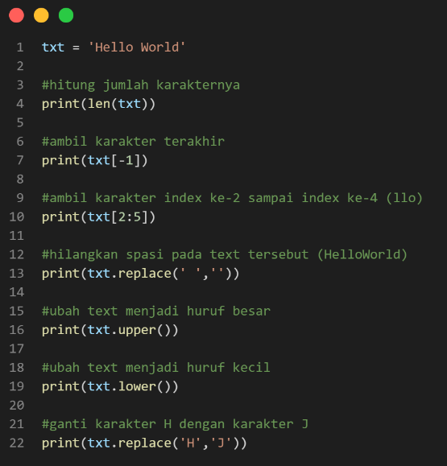
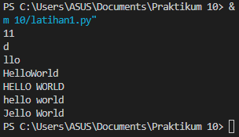

## Percobaan ke-1

## Hasil Output

### Penjelasan 
- dalam menghitung jumlah karakter bisa menggunakan fungsi `len`. contohnya `len(txt)`, dimana len berfungsi untuk menghitung jumlah karakter.
- Cara mengambil karakter terakhir pada string yaitu menggunakan `index [-1]`.
- Cara mengambil karakter index ke-2 sampai ke-4 yaitu menggunakan `index [2:5]`.
- Cara menghilangkan spasi pada text (Hello World) yaitu menggunakan method `replace(' ','')`. dimana kutip yang ada spasinya ' ' diganti dengan kutip yang tidak ada spasinya ''.
- Cara mengubah text menjadi besar yaitu gunakan method `upper()`.
- Cara mengubah text menjadi kecil yaitu menggunakan method `lower()`.
- Cara mengubah karakter 'H' dengan karakter 'J' yaitu menggunakan method `replace()`.
